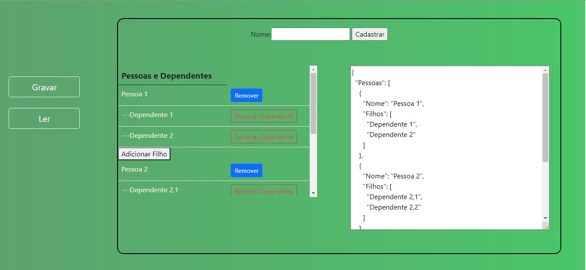
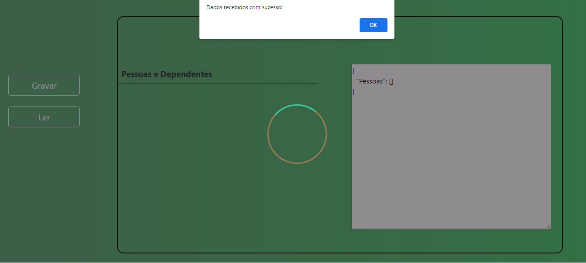

 <h1 align="center">Tabela e JSON </h1>
 
 ## Descrição do Projeto
<p align="center">O projeto foi produzido para fins de estudo e consiste em uma aplicação que utiliza botões para manipular uma tabela,de filhos e dependentes, que por sua vez manipula um JSON que é exibido ao lado da tabela e este Json é enviado atraves de uma requisição Ajax para um arquivo php que gera um banco com as tabelas Pessoas e Filhos e as associa.</p>

<p>Através do botão Gravar os dados da tabela são persistidos no banco de dados (que é construido automaticamente com PHP) e através do Botão ler é possivel resgatar os dados que foram persistidos no banco.</p>

 ## Tecnologias utilizadas
 * PHP
 * Bootstrap
 * Javascript
 * MYSQL SGDB default (pode ser alterado)
 * HTML

 ## Imagens da aplicação

<h2 align="center">
  
</h2> <br>
<h2 align="center">
  
</h2>

## <center> Instalação </center>
Antes de começar é necessário preparar o ambiente para o PHP com um software como o [XAMPP](https://www.apachefriends.org/pt_br/index.html) e o  [GIT](https://git-scm.com/) também é necessário um SGDB como MYsql que foi utilizado no desenvolvimento da Aplicação. 

```bash
# Clone este repositório
$ git clone <https://github.com/KevinEduardoM/JsoneTabela.git>

Adicione o repositório no diretório de um servidor web,caso utilize XAMPP o caminho é xampp\htdocs

após isso basta iniciar o servidor da sua maquina.
# e acessar (http://localhost/GoodRecipes-master/)
```

### <center> Configuração </center>
* É necessário atualizar as configurações, como User e Password, presentes em Model/bd para realizar a conexão com o banco de dados.

